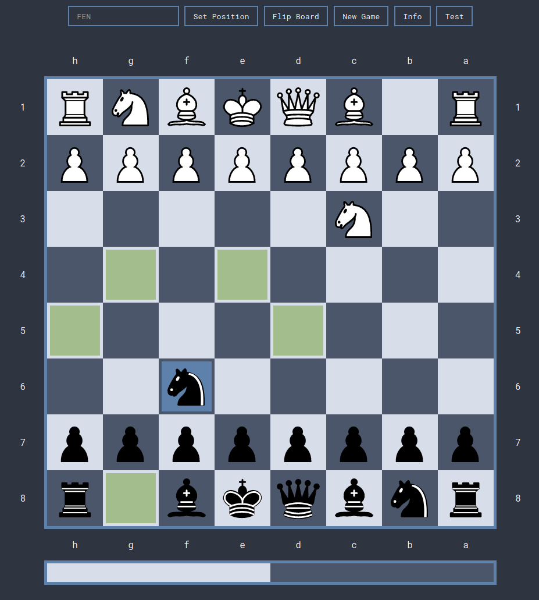

Note: This project is WIP and not yet usable.

# About
The goal of this small chess engine is not to reach the absolute best performance,  
instead I want to focus on creating a chess engine which has the ability of an average  
human player (estimated around 1100 chess.com ranking),  
and have a beautiful, user-friendly interface.  

# Current abilities
- start new game
- set any valid board position via [FEN](https://en.wikipedia.org/wiki/Forsyth%E2%80%93Edwards_Notation) string.
- able to flip board
- show/collapse ui explanation
- show possible moves for pawns and knights
- move pawns and knights

# TODO
- [ ] move gen
  - [x] pawn
  - [x] knight
  - [ ] bishop
  - [ ] rook
  - [ ] queen
  - [ ] king
- [ ] position evaluation
- [ ] show position evaluation in bar under chess board

# Current interface
Note: "test" button is used to trigger events on the wip part  
The blue square is the active square, the green squares are squares the knight can move to  
  
MIT © [Moritz Loewenstein](https://github.com/MoritzLoewenstein)
